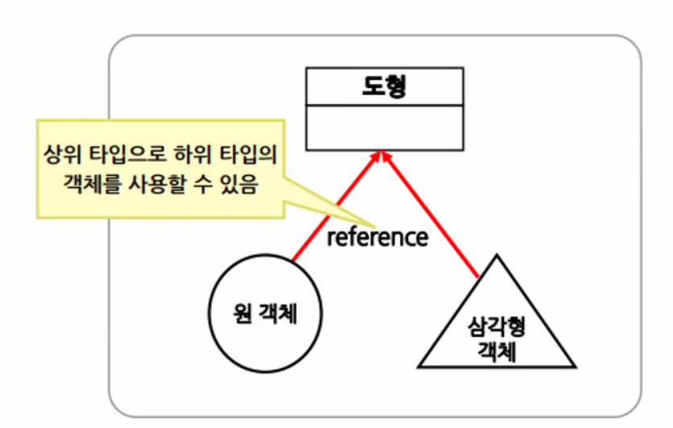

# 다형성(Polymoriphism)

#### 1.다형성이란 

- 객체지향 프로그래밍의 3대 특징중 하나로 '여러 개의 형태를 갖는다.'는 의미
- 하나의 행동으로 여러 가지 일을 수행하는 개념
- 상속을 이용한 기술로 부모 타입으로부터 파생된 여러 가지 타입의 자식객체를 부모클래스
  타입하나로 다룰 수 있는 기술



#### 2.  업캐스팅(Up Casting)

- 상속 관계에 있는 부모, 자식 클래스 간에 부모타입의 참조형 변수가 
  모든 자식 타입의 객체 주소를 받을 수 있음.

```java
//Sonata 클래스는  Car 클래스의 후손
Car c= new Sonata();
//Sonata 클래스형에서 Car클래스형으로 바뀜
```

**자식 객체의 주소를 전달받은 부모타입의 참조변수를 통해서 사용할 수 있는 후손의 정보는 
원래 부모타입이었던 멤버만 참조가능 (멤버==필드)


#### 3. 다운캐스팅(Down Casting)

- 자식 객체의 주소를 받은 부모 참조형 변수를 가지고 자식의 멤버를 참조해야 할 경우,

  부모 클ㄹ래스 타입의 참조형 변수를 **자식 클래스** 타입으로 형 변환하는 것

- 자동으로 처리되지 않기 때문에 반드시 후손 타입 명시해서 형 변환

```java
//Sonata  클래스는 Car 클래스의 후손
Car c= new Sonata();
((Sonata)c).moveSonata();
```

**클래스 간의 형 변환은 반드시 상속 관계에 있는 클래스끼리만 가능


#### 4.instanceof 연산자

- 현재 참조형 변수가 어떤 클래스 형의 객체 주소를 참조하고 있는지 확인 할 때 사용
  쿨랴수 터압아 맞으면  true, 아니면 false 반환

  ```java
  if(레퍼런스 instanceof 클래스타입) {
  //true일때 처리할 내용, 해당 클래스 타입으로 down casting
  }
  if(c instanceof Sonata) {
  ((Sonata)c).moveSonata();
  } else if (c instanceof Avante){
  ((Avante)c).moveAvante();
  } else if (c instanceof Grandure){
  ((Grandure)c).moveGrandure();
  }
  ```


#### 5. 객체배열과 다형성

- 다형성을 이용하여 상속 관계에 있는 하나의 부모 클래스 타입의 배열공간에
  여러 종류의 자식 클래스 객체 저장가능

  ```java
  Car[] carArr = new Car[5]; 
  carArr[0] = new Sonata();
  carArr[1] = new Avante();
  carArr[2] = new Grandure();
  carArr[3] = new Spark();
  carArr[4] = new Morning();
  ```

  

#### 6. 매개변수와 다형성

- 다형성을 이용하여 메소드 호출 시 부모타입의 변수 하나만 사용해 
  자식 타입의 객체를 받을수 있음.

```java
public void execute() {
driveCar(new Sonata()); 
driveCar(new Avante());
driveCar(new Grandure());
}
public void driveCar(Car c) {}
```

